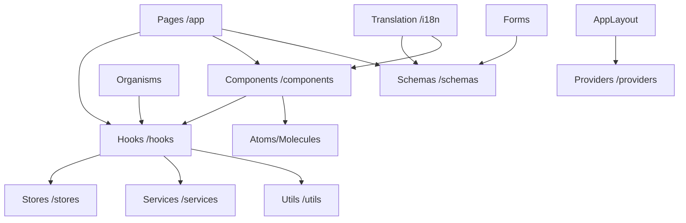

# App Architecture & Element Interactions

This document explains how different elements in the application interact and coordinate to build features. Use this as a guide when adding new functionality to the boilerplate.

## Overview of Interactions

## 1. Pages (`app/`)

Pages are the top-level route components managed by Expo Router.

- **Role**: Coordinate layout, fetch initial data via hooks, and compose organisms/molecules.
- **Interactions**:
  - Use **Hooks** for business logic and state access.
  - Use **Schemas** for form validation.
  - Use **Components** (Organisms/Molecules) to build the UI.
  - Pass data and callbacks down to children.

## 2. Components (`components/`)

Follows **Atomic Design** principles.

- **Atoms**: Smallest, pure UI units (Button, Typography, Icon). They don't have business logic.
- **Molecules**: Groups of atoms (FormInput, Header).
- **Organisms**: Complex feature sections (WorkoutDataView, ProfileForm).
- **Interactions**:
  - Atoms and Molecules are mostly pure and receive data via props.
  - Organisms often use **Hooks** to manage their own internal feature state or interact with global stores.
  - All components use **Translation** and **Theme** hooks for localization and styling.

## 3. Stores (`stores/`)

Built with **Zustand** for global state management.

- **Role**: Single source of truth for app-wide state (Auth, Workouts, Settings).
- **Interactions**:
  - Accessed primarily via **Hooks**.
  - Persisted using MMKV where necessary (e.g., Auth session).
  - Stores should remain focused on data; logic should live in Hooks or Services.

## 4. Schemas (`schemas/`)

Built with **Zod** for type-safe validation.

- **Role**: Define the shape of data and validation rules, especially for forms.
- **Interactions**:
  - Used by **Pages** or **Organisms** with `react-hook-form` and `zodResolver`.
  - Accept a translation function `t` to provide localized error messages.
  - Define TypeScript types inferred from the schema.

## 5. Providers (`providers/`)

React Context providers wrapping the application.

- **Role**: Provide global services that require React Lifecycle (Theme, Translation, BLE connectivity).
- **Interactions**:
  - Wrapped in the root `_layout.tsx`.
  - Exposed via specialized **Hooks** (e.g., `useColors`, `useTranslation`).

## 6. Translation (`i18n/`)

Managed via `expo-localization` and `i18n-js`.

- **Role**: Provides multi-language support.
- **Interactions**:
  - Accessed via the `useTranslation` hook.
  - Used by **Schemas** for validation messages.
  - Used by **Components** and **Pages** for all user-visible text.

## 7. Hooks (`hooks/`)

Encapsulate reusable business logic.

- **Role**: Functional interface between UI and logic/state.
- **Interactions**:
  - Use **Stores** to read/write global state.
  - Use **Services** for API calls or external interactions (BLE, Supabase).
  - Use **Utils** for pure logic/calculations.
  - Provide a clean `{ state, actions }` API to components.

## 8. Utils (`utils/`)

Pure helper functions.

- **Role**: Calculations, formatting, and stateless logic.
- **Interactions**:
  - Independent of React (no hooks inside).
  - Used by **Hooks**, **Services**, and sometimes **Components** for data transformation.
  - Includes formatting (dates, numbers), error handling, and logging.

## Core Services (`services/`)

While not explicitly asked, Services handle external communication (Supabase, BLE).

- **Interactions**:
  - Called by **Hooks**.
  - Stateless or manage their own low-level connection state.
  - Return raw data that Hooks then process and put into **Stores**.
