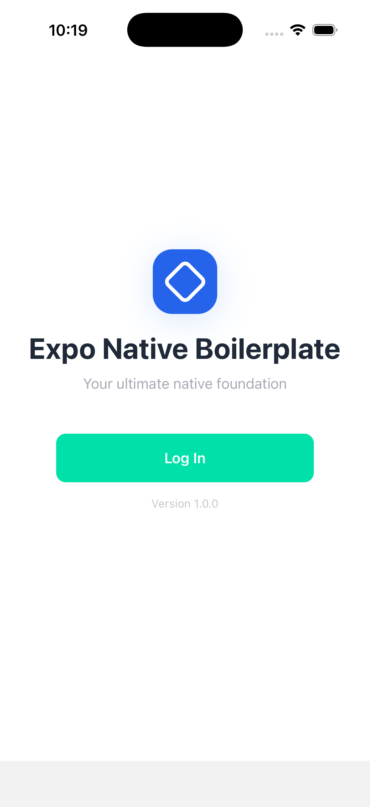
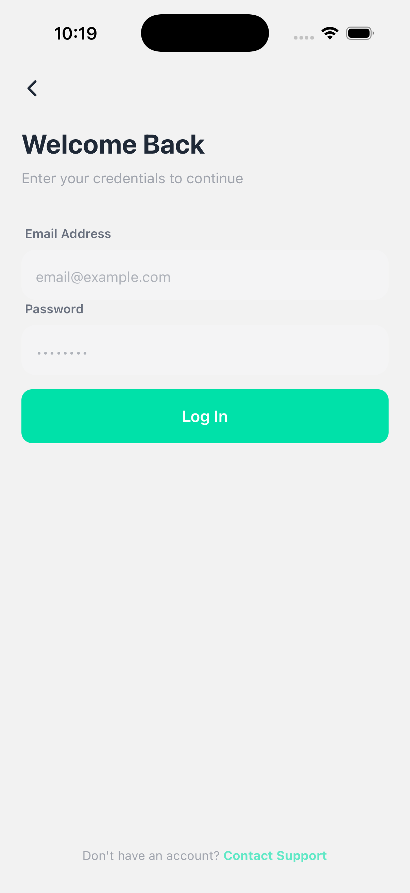
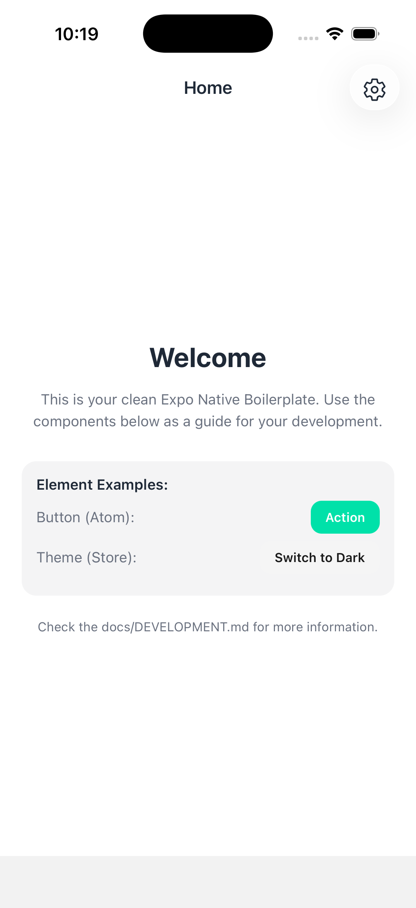
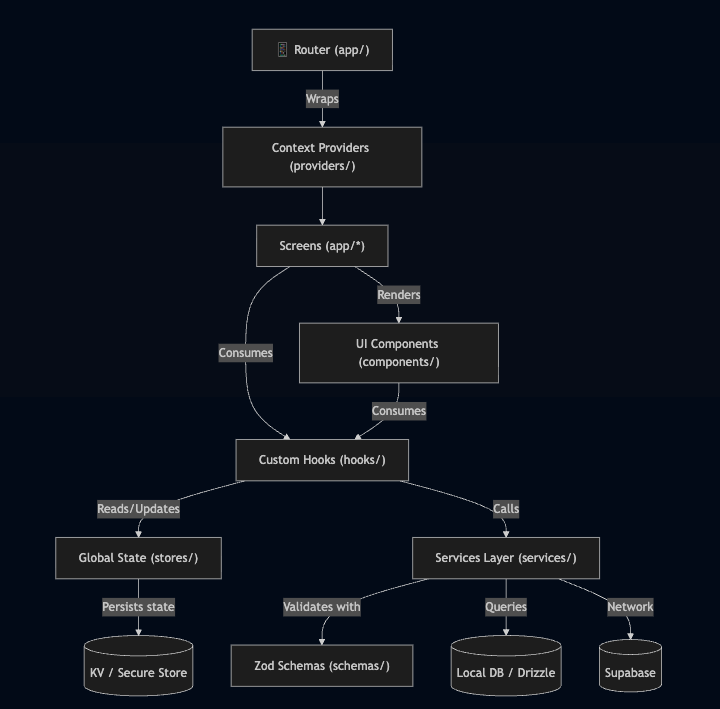

# Expo Native Boilerplate

<div align="center">
  
  <br/>
  <p><strong>A professional, high-quality Expo React Native boilerplate designed for building scalable mobile applications with a robust, cloud-agnostic architecture.</strong></p>
</div>

## 📸 Screenshots

<p align="center">
  
  
  
  
</p>

## 🚀 Features

- **Auth System**: Ready-to-use authentication with Supabase (Login, Register, Profile Management).
- **Refined Service Layer**: Vendor-agnostic service interfaces for Auth, Storage, and Database.
- **Theming Engine**: Dynamic light/dark mode support using Zustand and a specialized `useColors` hook.
- **i18n Localization**: Multi-language support out of the box (EN, ES, DE, JA).
- **Atomic Design**: Structured component hierarchy (Atoms, Molecules, Organisms).
- **Local Persistence**:
  - **Relational DB**: SQLite + Drizzle ORM for structured data.
  - **KV Store**: High-performance SQLite KV store (`expo-sqlite/kv-store`) for state persistence (Zustand).
  - **Secure Storage**: Expo Secure Store for sensitive credentials.
- **Secret Management**: Integrated Doppler support for secure environment variable management.
- **Safe Area & Layouts**: Best-in-class handling of safe areas and reusable `PageLayout` components.

## 🛠️ Tech Stack

- **Framework**: Expo 54 / React Native 0.81
- **Language**: TypeScript 5
- **Navigation**: Expo Router (File-based)
- **State Management**: Zustand 5
- **Styling**: NativeWind (Tailwind CSS)
- **Validation**: Zod + React Hook Form
- **Auth/Backend**: Supabase
- **Local DB**: Expo SQLite + Drizzle ORM

---

## 🚦 Getting Started

### 1. Install dependencies

```bash
yarn install
```

### 2. Configuration & Secrets

This project uses [Doppler](https://www.doppler.com/) for seamless secret management. To set up your local configuration:

```bash
# Install Doppler CLI (macOS)
brew install dopplerhq/cli/doppler

# Log in to your Doppler account
doppler login

# Set up the project environment (uses doppler.yaml)
doppler setup
```

_(Alternatively, you can manually copy `.env.example` to `.env` to provide the required environment variables without Doppler.)_

### 3. Run the App

Start the development server:

```bash
# Start Metro bundler (Doppler-managed)
yarn start

# Run on iOS simulator or Android emulator
yarn ios
yarn android
```

---

## 💻 Development Commands

Maintain code quality, ensure correct types, and prevent regressions using the built-in tooling.

### Testing

Tests use **Jest + jest-expo + @testing-library/react-native**. End-to-end flows are handled via **Maestro**.

```bash
yarn test              # Run all unit tests
yarn test:watch        # Run unit tests in watch mode
yarn test:coverage     # Run unit tests and generate a coverage report
yarn test:e2e          # Run Maestro E2E authentication flow
```

### TypeScript & Linting

```bash
# Type-check the project without emitting files
yarn tsc

# Run ESLint + Prettier check
yarn lint

# Auto-format all files using Prettier
yarn format
```

### Pre-commit Hooks

Husky automatically runs a full validation pipeline (`yarn pre-commit`) before every commit. This checks formatting, linting, TypeScript types, and tests, ensuring that no broken code enters the repository.

---

## 🏗️ Architecture



---

## 📁 Directory Structure

- `app/`: Expo Router file-based navigation (clean and minimal).
- `components/`: Atomic UI components (atoms, molecules, organisms).
- `hooks/`: Custom React hooks for business logic, themes, and localization.
- `services/`: API and storage service implementations (Auth, DB, Storage).
- `stores/`: Zustand global state management with SQLite persistence.
- `providers/`: Context providers for global orchestration.
- `i18n/`: Translation files and localization config.

## 📖 Deeper Dive

For a complete breakdown of the project architecture, automated pipelines, native builds, and comprehensive best practices, see the full [Development Guide](./docs/DEVELOPMENT.md).
